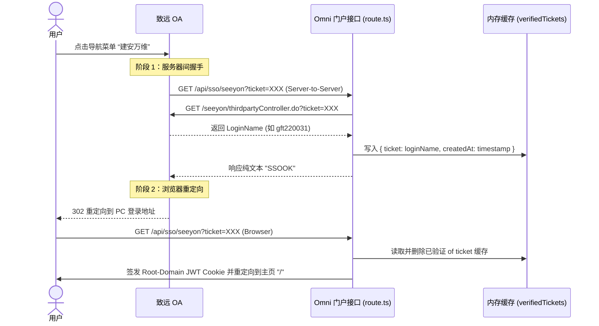

# 开发总结：致远 OA CIP 门户单点登录集成与调试

- **归档日期**：2026-07-29
- **涉及模块/文件**：
  - [route.ts](file:///c:/Users/gaoft/Documents/CodeSpace/Omni/app/api/sso/seeyon/route.ts)
  - [sso_analysis_report.md](file:///C:/Users/gaoft/.gemini/antigravity-ide/brain/bdfe43bd-dc9f-498f-b3f7-effff62de421/sso_analysis_report.md)
- **阶段状态**：已完成

---

## 1. 本阶段完成工作
- **排查占位符问题**：分析了致远 OA 关联系统参数传递机制，确认 `{ticket}` 与 `$$Ticket$$` 在传统关联系统中由于模块限制未被正确解析，导致传递了字面量。
- **改用 CIP 门户认证机制**：协助用户切换到致远 OA 的 **“CIP 集成平台 -> 单点登录 -> 门户认证机制”**，由导航菜单作为入口发起 SSO。
- **重构 Next.js SSO 接口**：由于“门户认证机制”采用两阶段握手（阶段 1 服务器对服务器校验并返回 `SSOOK`，阶段 2 浏览器跳转并验证本地缓存），重构了 `/api/sso/seeyon` 路由，使用内存缓存（带 60 秒自动清理）实现了无状态 API 对两阶段握手的完美融合。
- **发布与运行**：更新远程服务器代码，构建并重启 PM2 服务，全线打通单点登录。

## 2. 核心架构与实现细节
致远 OA CIP 门户认证时序设计如下：

## 3. 踩坑经验与避坑指南
- **问题 1：传统关联系统不生成票据**
  - **原因**：OA 的 `信息集成配置 -> 关联系统管理` 属于旧模块，无法在 URL 中识别或解析动态的单点登录 ticket，除非编写服务器端 XML 插件。
  - **解决**：必须推荐用户使用现代的 **“CIP 集成平台”**，选择 **“门户认证机制”**，此时 OA 会自动管理和生成 ticket 传递。
- **问题 2：两阶段握手的响应格式**
  - **报错**：直接跳转至 `/login-failed` 或卡在中间页面。
  - **解决**：后台在服务器握手（即第一次请求）时**必须**返回字面量纯文本 **`SSOOK`**，不能是 HTML、JSON 或 302 重定向。否则致远 OA 服务器会认为校验失败。

## 4. 下一步交接指引
- [x] 完成用户单点登录和身份映射的打通。
- [ ] 观察日志，检查是否有过期 Ticket 清理的垃圾回收异常。
- **关联依赖**：在添加其他应用系统（如 FabFlow, WeldSnap 等）的单点登录时，可使用 [child-app-middleware-template.ts](file:///c:/Users/gaoft/Documents/CodeSpace/Omni/docs/child-app-middleware-template.ts) 共享 JWT Cookie 的认证结果，直接实现跨系统无感免登。
