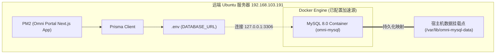

# 开发总结：远程 Docker 与 MySQL 8.0 生产级部署及数据库初始化

- **归档日期**：2026-07-30
- **涉及模块/文件**：
  - [schema.prisma](file:///c:/Users/gaoft/Documents/CodeSpace/Omni/prisma/schema.prisma)
  - [seed.ts](file:///c:/Users/gaoft/Documents/CodeSpace/Omni/prisma/seed.ts)
  - [page.tsx](file:///c:/Users/gaoft/Documents/CodeSpace/Omni/app/page.tsx)
  - [Dashboard.tsx](file:///c:/Users/gaoft/Documents/CodeSpace/Omni/app/Dashboard.tsx)
- **阶段状态**：已完成

---

## 1. 本阶段完成工作
- **Docker 容器环境部署**：在远端 Ubuntu 服务器上安装并启用了 Docker，针对国内网络配置了稳定可靠的镜像加速源（`daemon.json`）。
- **生产级 MySQL 8.0 容器部署**：
  - 绑定 `127.0.0.1:3306` 限制公网访问。
  - 数据目录挂载宿主机 `/var/lib/omni-mysql-data` 实现持久化存储。
  - 自动生成 24 位高强度随机管理员密码。
- **项目数据库迁移与初始化**：
  - 同步本地所有的 `prisma/migrations` 文件夹至远端。
  - 升级/更新了远端 `.env` 文件的 `DATABASE_URL`，成功保留其他变量。
  - 远程运行 `npx prisma generate`、`npx prisma migrate deploy` 和 `npx prisma db seed`，完美实现数据建表与 5 条应用卡片数据的无缝注入。
- **打包部署与应用重启**：
  - 远程运行 `pnpm build`，成功编译更新后的动态卡片加载逻辑。
  - PM2 重启 `Omni` 门户进程，系统完美进入生产运行态。

---

## 2. 核心架构与实现细节

- **安全加固**：通过在 `docker run` 时指定 `-p 127.0.0.1:3306:3306`，保证数据库只对服务器本机内网暴露，杜绝任何外部网络端口扫描和暴力破解。
- **Prisma 数据解耦**：[page.tsx](file:///c:/Users/gaoft/Documents/CodeSpace/Omni/app/page.tsx) 在服务器端获取数据库内容后，以 `initialApps` Prop 直接下发至 `use client` 状态的客户端组件 [Dashboard.tsx](file:///c:/Users/gaoft/Documents/CodeSpace/Omni/app/Dashboard.tsx)，实现了完美的混合渲染。

---

## 3. 踩坑经验与避坑指南
- **问题 1：国内企业内网环境 Docker 镜像超时**
  - **报错**：`docker: Error response from daemon: dial tcp ... i/o timeout`
  - **解决**：在 `/etc/docker/daemon.json` 中配置了网易、DaoCloud 和 1Panel 等国内镜像加速站点，重载并重启 docker 服务，镜像秒级拉取成功。
- **问题 2：字符集问题**
  - **现象**：命令行直接通过 `docker exec` 进入 mysql 查询时汉字显示为 `??`。
  - **提示**：底层数据本身采用 `utf8mb4` 无损存储。用客户端查询时务必指定 `mysql --default-character-set=utf8mb4`，应用程序本身已完美处理中文字符集，无需额外调整。

---

## 4. 下一步交接指引
- [x] 完成远程 Docker + MySQL 8.0 的部署与 Prisma 数据迁移。
- [x] 成功将卡片展示逻辑修改为从数据库动态提取。
- [ ] 后续如需增加新子系统，只需通过数据库客户端连接本地 3306 端口在 `apps` 表中增加记录即可，门户首页将**实时无感自动加载**新卡片，无需再次修改并部署代码。
